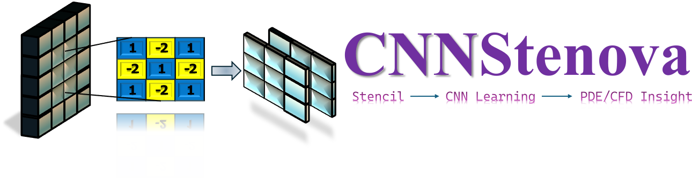

# CNNStenova
  

[](https://cnnstenova.streamlit.app/) 


CNNStenova is an interactive Streamlit educational and research tool for learning finite-difference stencils and PDE update operators as interpretable convolutional neural-network kernels.
It reuses the analytical solvers, finite-difference solvers, CNN kernel learners and training routines from the [CNN numerical schemes repository](https://github.com/kwamea-b/CNN_numerical_schemes)

## Live demo

CNNStenova is available online here:

https://cnnstenova.streamlit.app/ 

## Features

- Diffusion stencil visualisation
- CNN kernel learning from numerical or analytical PDE data
- Scaled finite-difference stencil recovery
- Von Neumann stability analysis
- Forced Burgers equation CNN kernel learning
- Rollout prediction and error visualisation

## Installation

```bash
pip install -r requirements.txt
